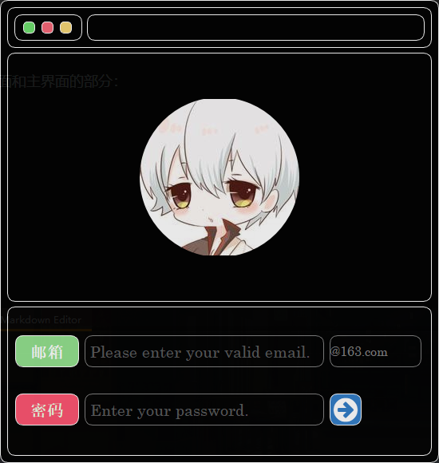
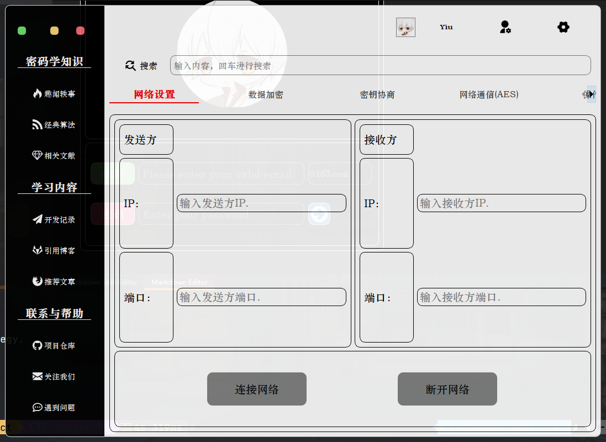
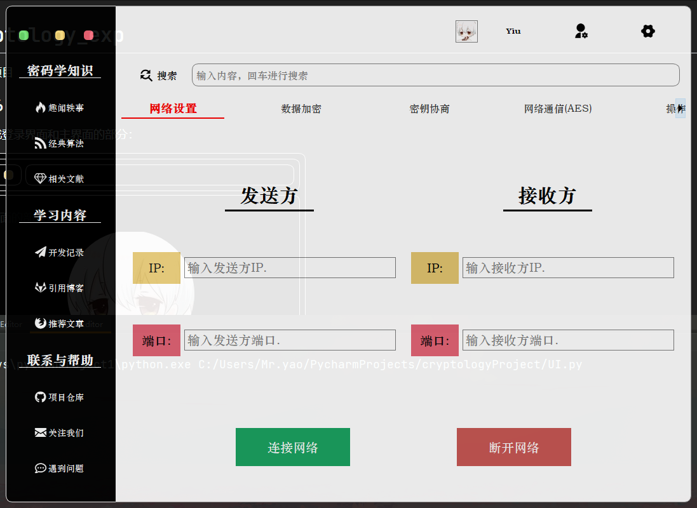
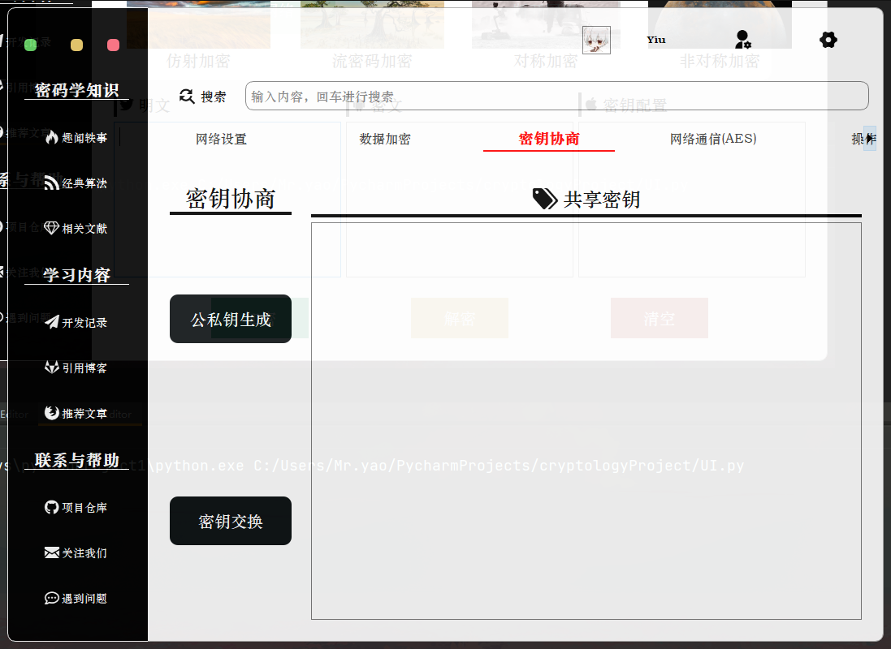
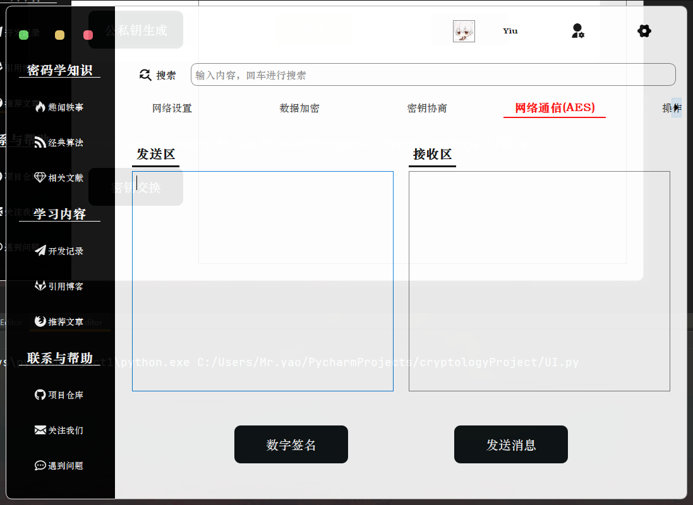
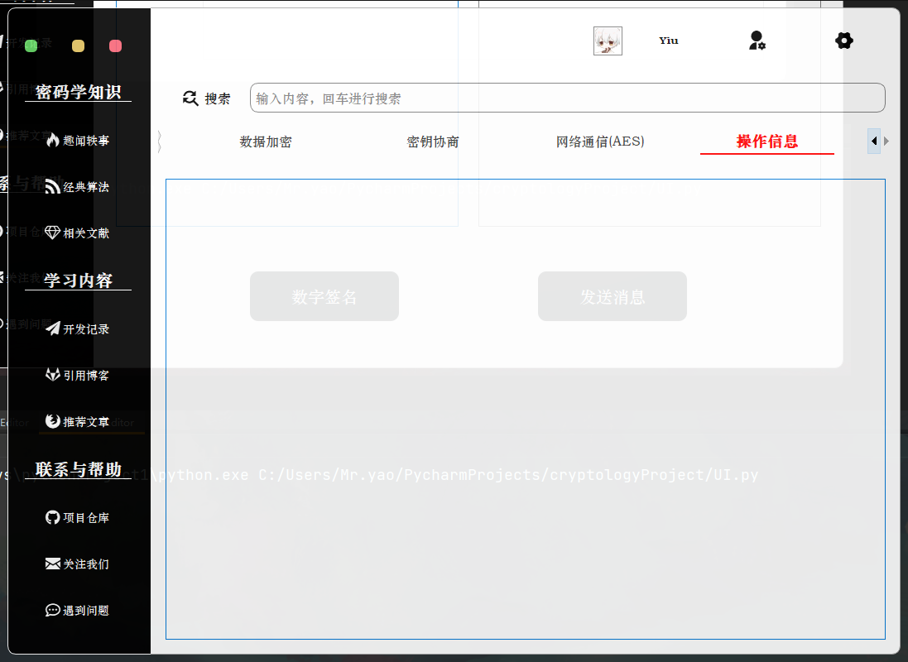
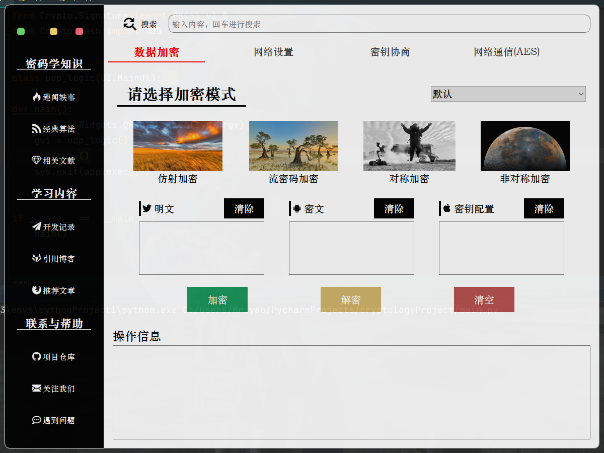

# UI设计

# 数据加密

## 流密码

## 仿射加密

## 对称加密

## 非对称加密

# DH协议

# openssl通信部分

## openssl安装

利用第三方提供的开源工具直接无脑安装，例如：
http://slproweb.com/products/Win32OpenSSL.html

直接按照普通的windows程序next，next的安装就行了。


最后我们在环境变量中，将bin文件夹配置起来，就可以在命令行中调用OpenSSL了。如果暂时没成功的话就重启一下电脑让配置生效。


查看是否安装成功


## ssl通信原理


SSL通信的本质是啥？本质就是客户端拿着认证机关的证书去认证对方网站到底是不是你要访问的。

因为有人会写一个假的网站骗取流量（及流量劫持）。如果一旦在这个假的网站上输入了用户名密码之后就存在着信息滥用的风险。

为了避免这样的情况，所以才有SSL这个工具。

- 客户端以后每次访问一个重要的网站时就要拿着发证机关CA（Cerficate Authority）的证书和对方连接的时候验证一下。咋验证的呢？客户端连接的时候服务端也有证书，这个证书也是CA发给他们的，里面的内容进行了加密，只要拿CA发给客户的那个证书对接一些就知道对面网站的那个证书是不是真的。这就是SSL的基本逻辑。

- 同时通信的过程也是加密了的，这样就不太容易被窃听的人看明白（即中间人攻击）。

所以SSL等于解决了两个问题，1 流量劫持 2 中间人攻击。

**SSL协议通信的握手步骤**如下：

- 第1步，SSL客户机连接至SSL服务器，并要求服务器验证它自身的身份；

- 第2步，服务器通过发送它的数字证书证明其身份。这个交换还可以包括整个证书链，直到某个根证书颁发机构（CA）。通过检查有效日期并确认证书包含可信任CA的数字签名来验证证书的有效性。

- 第3步，服务器发出一个请求，对客户端的证书进行验证，但是由于缺乏公钥体系结构，当今的大多数服务器不进行客户端认证。

- 第4步，协商用于加密的消息加密算法和用于完整性检查的哈希函数，通常由客户端提供它支持的所有算法列表，然后由服务器选择最强大的加密算法。

- 第5步，客户机和服务器通过以下步骤生成会话密钥：
  - 客户机生成一个随机数，并使用服务器的公钥（从服务器证书中获取）对它加密，以送到服务器上。
  - 服务器用更加随机的数据（客户机的密钥可用时则使用客户机密钥，否则以明文方式发送数据）响应。

## ssl通信实现

### 证书生成

```terminal
# 1.先创建 CA 私钥，这个是用来生成ca.crt用的
openssl genrsa -out ca.key 2048

# 2.然后生成自签名CA证书，这个才是我们要用的东西。
openssl req -new -x509 -days 3650 -key ca.key -out ca.crt -subj "/C=CN/ST=hunan/L=changsha/O=HNU/OU=csee/CN=CA_zino"

# 3.生成服务器私钥。注意这个跟刚才那个CA不是一回事了，相当于实际业务中的需要被认证的网站。
openssl genrsa -out server.key 2048

# 4.生成要颁发证书的证书签名请求
openssl req -new -key server.key -out server.csr -subj "/C=CN/ST=hunan/L=changsha/O=HNU/OU=csee/CN=127.0.0.1"

# 5.用刚才第2步创建的 CA 证书给第4步生成的 签名请求 进行签名，表明该证书请求已被CA信任，得到一个被CA签名过的证书。
openssl x509 -req  -days 3650 -in server.csr -CA ca.crt -CAkey ca.key -set_serial 01 -out server.crt

# 之后就是客户端用CA证书来对服务端被CA签名过的证书来进行认证
openssl  verify  -CAfile  ca.crt  server.crt
```


用CA验证服务端证书是否可信


### 服务端实现

ssl类具体函数定义和参数含义可参考[官方文档](https://docs.python.org/zh-cn/3/library/ssl.html#module-ssl)

```python
import socket
import ssl
ip_port = ('127.0.0.1', 9999)
# 创建了一个 SSL上下文,ssl.PROTOCOL_TLS表示选择客户端和服务器均支持的最高协议版本
context = ssl.SSLContext(ssl.PROTOCOL_TLS)
# 加载一个私钥及对应的证书
context.load_cert_chain(certfile="server.crt", keyfile="server.key")

sk = socket.socket()            # 创建套接字
sk.bind(ip_port)                # 绑定服务地址
sk.listen(5)                    # 监听连接请求

print('启动socket服务，等待客户端连接...')

connect_sock, address = sk.accept()     # 等待连接，此处自动阻塞
# 包装一个现有的 Python socket,并返回一个ssl socket,server_side为true表示为服务器行为，默认为false则表示客户端
ssl_connect_sock = context.wrap_socket(connect_sock, server_side=True)
while True:     # 一个死循环，直到客户端发送‘exit’的信号，才关闭连接
    client_data = ssl_connect_sock.recv(1024).decode()      # 接收信息
    if client_data == "exit":       # 判断是否退出连接
        sk.close()  # 关闭连接
        exit("通信结束")
    print("来自%s的客户端向你发来信息：%s" % (address, client_data))
    ssl_connect_sock.sendall('服务器已经收到你的信息'.encode())    # 回馈信息给客户端
```

### 客户端实现

```python
import socket
import ssl
import pprint
# 创建了一个 SSL上下文,ssl.PROTOCOL_TLS表示选择客户端和服务器均支持的最高协议版本
context = ssl.SSLContext(ssl.PROTOCOL_TLS)
# 设置模式为CERT_REQUIRED，在此模式下，需要从套接字连接的另一端获取证书；如果未提供证书或验证失败则将引发 SSLError。
context.verify_mode = ssl.CERT_REQUIRED
# 加载一组用于验证服务器证书的CA证书
context.load_verify_locations("ca.crt")
# 设置端口
ip_port = ('127.0.0.1', 9999)
# 创建套接字
s = socket.socket()
# 包装一个现有的 Python 套接字 sock 并返回一个 SSLContext.sslsocket_class 的实例 (默认为 SSLSocket)。
# 返回的 SSL 套接字会绑定上下文、设置以及证书
ssl_sock = context.wrap_socket(s, server_hostname='127.0.0.1')

# 连接服务器
ssl_sock.connect(ip_port)
# 输出证书信息
pprint.pprint(ssl_sock.getpeercert())
while True:     # 通过一个死循环不断接收用户输入，并发送给服务器
    inp = input("请输入要发送的信息： ").strip()
    if not inp:     # 防止输入空信息，导致异常退出
        continue
    ssl_sock.sendall(inp.encode())

    if inp == "exit":   # 如果输入的是‘exit’，表示断开连接
        print("结束通信！")
        break

    server_reply = ssl_sock.recv(1024).decode()
    print(server_reply)
s.close()    # 关闭连接
```

## 基于UI的实现

因为在UI中我们目标是在一个文件内实现客户端和服务端通信，这就需要采用线程

而如果使用普通的线程创建函数，会遇到在子线程里操作UI界面会出现未知错误的问题

所以后面采用了Qthread这个QT专门提供的线程类

可以实现子线程通过信号量向父线程发送消息，从而达到在父线程里操作UI的目的。

基本框架基于还是上面的代码，但是根据UI的需要，做了一部分必要的改动。

```python
    class server_thread(QThread):
        # 定义信号,定义参数为str类型
        sendSignal = pyqtSignal(str)
        appendSignal = pyqtSignal(str)

        def __init__(self, parent=None):
            super().__init__(parent)
            self.ssl_address = None
            self.ssl_connect_sock = None
            self.ssl_server_socket = None

        def run(self):
            ip_port = ('127.0.0.1', 9999)
            context = ssl.SSLContext(ssl.PROTOCOL_TLS)  # 创建了一个 SSL上下文,ssl.PROTOCOL_TLS表示选择客户端和服务器均支持的最高协议版本
            context.load_cert_chain(certfile="../cert/server.crt", keyfile="../cert/server.key")  # 加载一个私钥及对应的证书

            sk = socket.socket()  # 创建套接字
            sk.bind(ip_port)  # 绑定服务地址
            sk.listen(5)  # 监听连接请求

            msg = '#服务端消息#：启动socket服务，等待客户端连接...'
            self.sendSignal.emit(msg)
            self.ssl_connect_sock, self.ssl_address = sk.accept()  # 等待连接，此处自动阻塞
            # 包装一个现有的 Python socket,并返回一个ssl socket,server_side为true表示为服务器行为，默认为false则表示客户端
            self.ssl_server_socket = context.wrap_socket(self.ssl_connect_sock, server_side=True)
            while True:  # 一个死循环
                client_data = self.ssl_server_socket.recv(1024).decode()  # 接收信息
                if client_data == 'exit':
                    break
                self.appendSignal.emit(client_data)
                msg = "#服务端消息#：收到来自%s的客户端发来的信息:%s" % (self.ssl_address, client_data)
                self.sendSignal.emit(msg)

    class client_thread(QThread):
        # 定义信号,定义参数为str类型
        sendSignal = pyqtSignal(str)
        appendSignal = pyqtSignal(str)

        def __init__(self, parent=None):
            self.ssl_client_socket = None
            super().__init__(parent)

        def run(self):
            context = ssl.SSLContext(ssl.PROTOCOL_TLS)  # 创建了一个 SSL上下文,ssl.PROTOCOL_TLS表示选择客户端和服务器均支持的最高协议版本
            context.verify_mode = ssl.CERT_REQUIRED  # 设置模式为CERT_REQUIRED，在此模式下，需要从套接字连接的另一端获取证书；如果未提供证书或验证失败则将引发 SSLError
            context.load_verify_locations("../cert/ca.crt")  # 加载一组用于验证其他对等方证书的CA证书
            ip_port = ('127.0.0.1', 9999)  # 设置端口
            s = socket.socket()  # 创建套接字
            # 包装一个现有的 Python 套接字 sock 并返回一个 SSLContext.sslsocket_class 的实例 (默认为 SSLSocket)。
            self.ssl_client_socket = context.wrap_socket(s, server_hostname='127.0.0.1')  # 返回的 SSL 套接字会绑定上下文、设置以及证书

            self.ssl_client_socket.connect(ip_port)  # 连接服务器
            msg = '#客户端消息#：客户端成功验证服务端证书，已成功连接，服务端证书信息如下'  # 输出证书信息
            self.sendSignal.emit(msg)
            cert = pprint.pformat(self.ssl_client_socket.getpeercert())
            self.sendSignal.emit(cert)
            msg = '请在文本框输入要发送的消息'
            self.sendSignal.emit(msg)

            while True:  # 一个死循环
                server_data = self.ssl_client_socket.recv(1024).decode()  # 接收信息
                if server_data == 'exit':
                    break
                self.appendSignal.emit(server_data)
                msg = "#客户端消息#：收到来自%s的服务端发来的信息:%s" % (ip_port, server_data)
                self.sendSignal.emit(msg)

    def server_append(self, data):
        self.tab.tab5TextEdit_1.clear()
        self.tab.tab5TextEdit_1.appendPlainText(data)

    def client_append(self, data):
        self.tab.tab5TextEdit_2.clear()
        self.tab.tab5TextEdit_2.appendPlainText(data)

    def ssl_start_server(self):
        self.ssl_server_thread = self.server_thread()
        self.ssl_server_thread.sendSignal.connect(self.send_Show_msg)
        self.ssl_server_thread.appendSignal.connect(self.server_append)
        self.ssl_server_thread.start()

    def ssl_start_client(self):
        self.ssl_client_thread = self.client_thread()
        self.ssl_client_thread.sendSignal.connect(self.send_Show_msg)
        self.ssl_client_thread.appendSignal.connect(self.client_append)
        self.ssl_client_thread.start()

    def ssl_server_send(self):
        text = self.tab.tab5TextEdit_1.toPlainText()
        self.ssl_server_thread.ssl_server_socket.sendall(text.encode())  # 回馈信息给客户端

    def ssl_client_send(self):
        inp = self.tab.tab5TextEdit_2.toPlainText()
        self.ssl_client_thread.ssl_client_socket.sendall(inp.encode())
```

## 运行过程

先点击服务端启动

再点击客户端启动

然后就可以愉快的进行客户端与服务端的ssl通信了

点击停止即可停止通信


# 开发记录

密码学项目

参考链接：

[https://mp.weixin.qq.com/s?spm=a2c6h.12873639.0.0.eb782367OsHsnu&__biz=MzI5NDY1MjQzNA==&mid=2247488070&idx=3&sn=0d7fa40a22165e497d1fd27228ff17de&chksm=ec5ecd3bdb29442d8d32a93e0cd35b5f971963a35bceb7e2130aac07493dd04b11acbb370573&scene=0#rd](UI设计参考)

[https://blog.csdn.net/jeekmary/article/details/79591431]()

[https://blog.csdn.net/qq_40602000/article/details/104652131]()

[https://blog.csdn.net/wowocpp/article/details/105228300]()

成员笔记：

[https://github.com/selfteaching/the-craft-of-selfteaching/issues/67]()

[https://zino00.github.io/posts/cf547d62/]()

[https://zino00.github.io/posts/cf547d62/]()

12/16

今日完成登录界面和主界面的部分：





### 12/17

今日把所有界面都完成，并且美化了（大概），看下效果：










### 12/24

工作进入尾声了


