# UI界面设计

## 前言

项目的呈现是以应用程序的方式进行展示，其中的核心之一UI设计是通过PyQt5库进行设计的，该库实际上是C++语言编写的跨平台的GUI库，支持Widows、Mac OS和Linux。由于Qt使用C++语言进行编写，所以使用Qt开发的GUI程序的界面风格与当前操作系统完全相同，而且运行效率很高。

但是在默认情况下，使用PyQt5创建出来的窗口和部件是默认的样式，个人审美下是十分的不美观的，所以需要对构建的图形界面进行一些美化。其实，在PyQt5中，我们可以有较高的自由度来自定义窗口和各种小部件的样式，通过自定义这些样式，以达到美化图形界面的目的。

首先可以看看效果图：

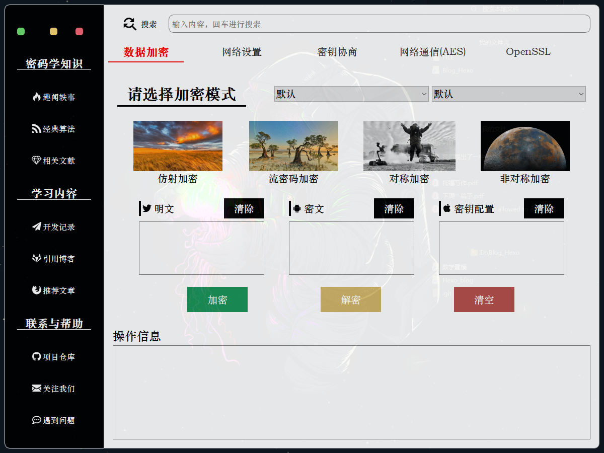

## 对界面进行布局和组件的布局

在图像界面变成中，一个好的布局有助于全局把控界面的形态，而在PyQt5中，有多种布局的方式供我们选择，比较常见的布局有以下计中：

- 表单布局：QFormLayout
- 网格布局：QGridLayout
- 水平排列布局：QHBoxLayout
- 垂直排列布局：QVBoxLayout

这四种布局都有自己对布局内小部件的控制方式和特点，在这个工程中选用网格布局作为图形界面布局的方案。

### 整体布局

在整体布局中将我们的界面分为左右两个部分，使用两个QWidget()部件作为左侧菜单模块和右侧内容模块的部件，布局分布如下：


其比例是2:10，在代码中体现如下：

```python
        self.main_layout.addWidget(self.left_widget, 0, 0, 12, 2)
        self.main_layout.addWidget(self.right_widget, 0, 2, 12, 10)
```

### 左侧菜单栏

在左侧菜单栏中依旧使用网格进行布局，在左侧的菜单布局中添加的所有部件均为按钮，即QPushButton()，这些按钮包括菜单按钮、菜单列提示以及窗口的最小化和和关闭功能按钮。其具体的布局如下：

```python
        self.left_layout.addWidget(self.left_mini, 0, 0, 1, 1)
        self.left_layout.addWidget(self.left_close, 0, 2, 1, 1)
        self.left_layout.addWidget(self.left_visit, 0, 1, 1, 1)

        self.left_layout.addWidget(self.left_label_1, 1, 0, 1, 3)
        self.left_layout.addWidget(self.left_button_1, 2, 0, 1, 3)
        self.left_layout.addWidget(self.left_button_2, 3, 0, 1, 3)
        self.left_layout.addWidget(self.left_button_3, 4, 0, 1, 3)

        self.left_layout.addWidget(self.left_label_2, 5, 0, 1, 3)
        self.left_layout.addWidget(self.left_button_4, 6, 0, 1, 3)
        self.left_layout.addWidget(self.left_button_5, 7, 0, 1, 3)
        self.left_layout.addWidget(self.left_button_6, 8, 0, 1, 3)

        self.left_layout.addWidget(self.left_label_3, 9, 0, 1, 3)
        self.left_layout.addWidget(self.left_button_7, 10, 0, 1, 3)
        self.left_layout.addWidget(self.left_button_8, 11, 0, 1, 3)
        self.left_layout.addWidget(self.left_button_9, 12, 0, 1, 3)
```

但是目前还没有进行样式的修改，只是单纯的将按钮给安到对应的网格当中，后面会具体介绍美化的方式以及跳转功能的实现。

## 右侧菜单栏

在右侧的内容模块中，有三个主要内容板块：

- 搜索板块
- 加解密，D-H协议以及OpenSSL三个集成的tab板块
- 操作信息显示板块

首先介绍一下三个板块的主要功能，搜索板块功能主要是打开浏览器将你所想要的内容利用百度进行搜索；集成tab板块主要是实现四种常见的加解密算法，D-H协议的通信以及OpenSSL的通信；操作信息显示板块则是将所有进行的操作进行显示，比如连接了网络，断开了网络等等……

其具体的网格分布图如下：

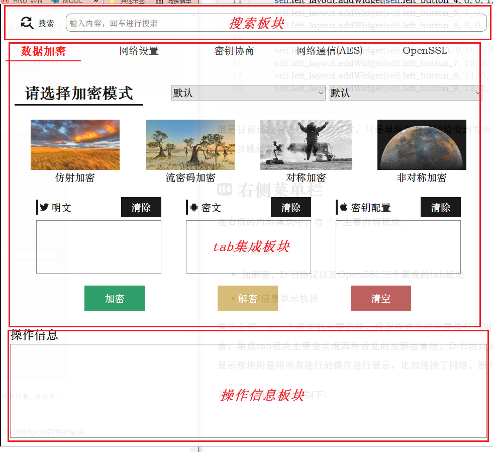

实际上，它就是将右侧的QWidget模块又给划分为三个网格模块。对于第一个和第三个板块容易实现，其核心是tab集成板块的设计，以下是tab集成板块的另外四个tab窗口的内容展示，它们也都是网络布局：

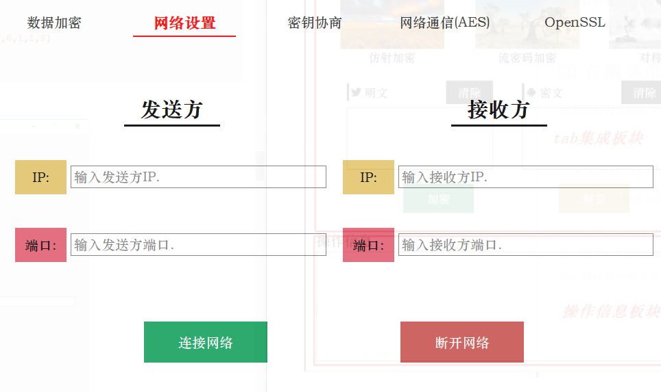


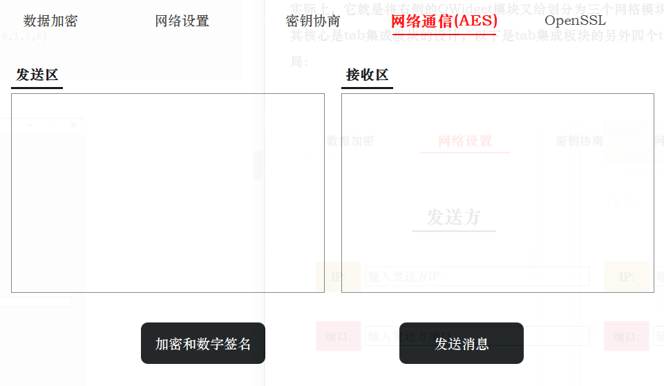


这个完整内容的实现可以在tapUI.py程序中看到，它利用的是QTabWidget，构建的TabDemo类就是继承这个类实现的，TabDemo的初始化具体如下：

```python
class TabDemo(QTabWidget):
    def __init__(self, parent=None):
        super(TabDemo, self).__init__(parent)

        self.tab1 = QWidget()
        self.tab2 = QWidget()
        self.tab3 = QWidget()
        self.tab4 = QWidget()
        self.tab5 = QWidget()

        self.addTab(self.tab2, "Tab 2")
        self.addTab(self.tab1, "Tab 1")
        self.addTab(self.tab3, "Tab 3")
        self.addTab(self.tab4, "Tab 4")
        self.addTab(self.tab5, "Tab 5")

        self.tab1UI()
        self.tab2UI()
        self.tab3UI()
        self.tab4UI()
        self.tab5UI()

        self.decorate()
```

## 用QSS和部件属性美化窗口部件

部件美化所使用的函数为setStyleSheet()函数，UI的部件美化和tab集成模块的美化都可以在当前类的decorate()函数中实现，由于代码体量较大就不展开一一介绍具体美化的细节，可以参考两篇文章：

- [如何在Python编写精美的图形界面](https://mp.weixin.qq.com/s?spm=a2c6h.12873639.0.0.eb782367OsHsnu&__biz=MzI5NDY1MjQzNA==&mid=2247488070&idx=3&sn=0d7fa40a22165e497d1fd27228ff17de&chksm=ec5ecd3bdb29442d8d32a93e0cd35b5f971963a35bceb7e2130aac07493dd04b11acbb370573&scene=0#rd)
- [Qt编写网易云界面](https://blog.csdn.net/weixin_42126427/article/details/119722142)

举个小例子：

```python
        self.left_close.setStyleSheet('''QPushButton{
        background:#F76677;
        border-radius:5px;}
        QPushButton:hover{background:red;}''')
        self.left_visit.setStyleSheet('''QPushButton{
        background:#F7D674;
        border-radius:5px;}
        QPushButton:hover{background:red;}''')
        self.left_mini.setStyleSheet('''QPushButton{
        background:#6DDF6D;
        border-radius:5px;}
        QPushButton:hover{background:red;}''')
```

这是UI.py文件中decorate函数中对于左上角三个功能按钮的修饰，最终达成的效果就是如下样式：


## 窗口实现无边框和圆角

通过以上的QSS对样式进行调整，所有关于UI的工作基本上完成了。现在需要使用PyQt5中各个部件的其他内置属性来完成这个图形界面的最终美化工作。

### 设置窗口背景透明

透明的窗口背景会让图形界面右现代感和时尚感，通过以下两个步骤可以进行实现：

```python
self.setWindowOpacity(0.9)
self.setAttribute(QtCore.Qt.WA_TranslucentBackground, True)
```

### 去除窗口边框

窗口背景设置为透明后的体验很不一样，但是那个默认的边框很不协调，那么去除丑丑的默认边框是必须要做的工作，通过窗口的setWindowFlag()属性我们可以设置窗口的状态从而把边框给隐藏了：

```python
self.setWindowFlag(QtCore.Qt.FramelessWindowHint) # 隐藏边框
```

为了避免隐藏窗口边框后，左侧部件没有背景颜色和边框显示，我们再对左侧部件添加QSS属性：

```python
QWidget#left_widget{  
    background:gray;  
    border-top:1px solid white;  
    border-bottom:1px solid white;  
    border-left:1px solid white;  
    border-top-left-radius:10px;  
    border-bottom-left-radius:10px;
}
```

### 贴合左右QtWidget模块

可以发现图形界面中左侧部件和右侧部件中有一条缝隙，我们通过设置布局内部件的间隙来把那条缝隙去除掉：

```python
self.main_layout.setSpacing(0)
```

这样出现的图形界面中就没有那条碍眼的缝隙了：

## 按钮点击事件

在UI.py文件中，使用connect函数将点击事件和具体功能进行绑定，然后通过继承，在子类中进行函数功能的重写：

```python
def connect(self):
    # 连接网络按钮
    self.tab.tap1_bottom_buttom_1.clicked.connect(self.click_On_net)
    # 断开网络按钮
    self.tab.tap1_bottom_buttom_2.clicked.connect(self.click_Off_net)
    # 公私钥生成
    self.tab.tap3_left_button_2.clicked.connect(self.click_PP_key)
    # 密钥交换
    self.tab.tap3_left_button_3.clicked.connect(self.click_Change_key)
    # 数字签名
    self.tab.tap4_bottom_buttom_1.clicked.connect(self.click_RSA_sign)
    # 发送消息
......
```

可以看到这些点击事件都是需要进行重写的：

```python
def ssl_end_threading(self):
    raise NotImplementedError

def ssl_start_server(self):
    raise NotImplementedError

def ssl_start_client(self):
    raise NotImplementedError

def remove_serverText(self):
    raise NotImplementedError

def remove_ClientText(self):
    raise NotImplementedError

......
```

# 数据加密

## 流密码

### RC4算法

原理：

```
一个256字节的状态向量S= {0，1，…，255}，用比特字节表示为S= {00000000, 00000001, ….，11111111}。如果用一个可变长度为1
```

~256字节（8~8048位）的密钥来初始化256字节的状态向量S={S[0], S[1], …, S[255]}，任何时候，S都包含0~255的8位无符号数的排列组合。加密和解密时，密码流中的每一个字节k由S产生，通过系统的方式随机从S的256个元素中选取一个。每产生一个字节k，S的元素都要被再次排列。

加解密过程：

```python
class RC4(object):
    def __init__(self, key=None):
        if not key:
            key = b'default_key'
        self.key = key.decode('utf-8')
        self._init_slist()
    # 初始化s列表 单下划线开头表示权限为protected
    def _init_slist(self):
        # 初始化s列表
        self.slist = [i for i in range(256)]
        # 初始化t列表
        length = len(self.key)
        t = [ord(self.key[i % length]) for i in range(256)]
        # 用t产生s的初始置换
        j = 0
        for i in range(256):
            j = (j + self.slist[i] + t[i]) % 256
            self.slist[i], self.slist[j] = self.slist[j], self.slist[i]
    # 加解密
    def do_crypt(self, ss):
        i = 0
        j = 0
        result = ''
        ss = ss.decode('utf-8')
        for s in ss:
            i = (i + 1) % 256
            j = (j + self.slist[j]) % 256
            self.slist[i], self.slist[j] = self.slist[j], self.slist[i]
            t = (self.slist[i] + self.slist[j]) % 256
            result += chr(ord(s) ^ self.slist[t])
            self.slist[i], self.slist[j] = self.slist[j], self.slist[i]
        return result.encode('utf-8')
```

实现效果：

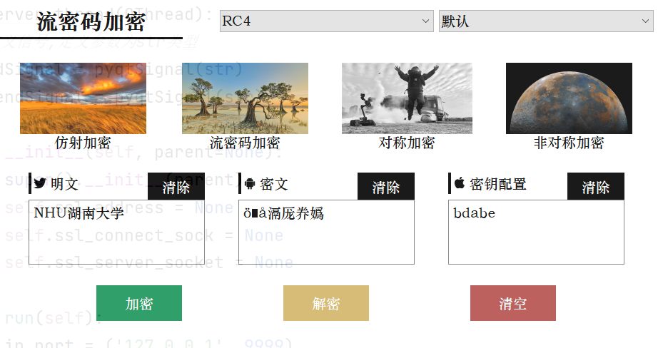

### LFSR+JK触发器算法

原理：
定义两个线性反馈移位寄存器（LFSR），并对初始状态进行初始化，将LFSR的特征[多项式](https://so.csdn.net/so/search?q=多项式&spm=1001.2101.3001.7020)作为密钥由用户输入（我们设置为8位密钥）。得到密钥我们就能根据以下线性反馈移位寄存器（LFSR）的原理，生成两个序列，这个LFSR可以产生的最大序列长度为2^m-1。将两个序列分别作为JK触发器的输入端J、K，并且根据JK触发器的结构及逻辑真值表，可以得到255位的密钥流。输入明文时，先将明文转换为二进制字符串，进行加密后，再转化为字符串。

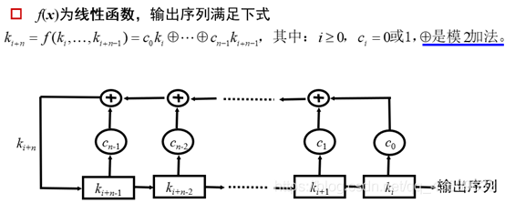

加解密过程：

```python
class LFSR:
    #生成两个LFSR序列
    def __init__(self, c=None, a=None, lenc=0):
        if a is None:
            a = []
        if c is None:
            c = []
        self.a = a
        self.c = c
        self.lenc = lenc
        lena = len(a)
        if lena < lenc:
            cnta = (lenc - lena) // lena + 1
            for i in range(cnta):
                self.a.extend(a)
    def LeftShift(self):
        lastb = 0
        lenc = self.lenc
        for i in range(lenc):
            lastb = lastb ^ (self.a[i] & self.c[i])
        b = self.a[1:]
        outp = self.a[0]
        b.append(outp)
        self.a = b
        return outp

class cypto_LFSR:
    def __init__(self, key, lfsr1 = None, lfsr2 = None):
        if lfsr1 is None:
            lfsr1 = [0, 1, 0, 1]#LFSR序列1
        if lfsr2 is None:
            lfsr2 = [0, 0, 1, 1]#LFSR序列2
        Keymap = get_str_bits(key)
        lenk = len(Keymap)
        self.lfsr1 = LFSR(Keymap, lfsr1, lenk)
        self.lfsr2 = LFSR(Keymap, lfsr2, lenk)
        self.Key = Keymap
        self.lc = 0
    def GetBit(self):
        ak = self.lfsr1.LeftShift()
        bk = self.lfsr2.LeftShift()
        ck = ak ^ ((ak ^ bk) & self.lc)  # JK触发器
        self.lc = ck
        return ck
    def do_crypt(self, LFSR_msg):
        text = []
        for i in LFSR_msg:
            j, cnt = i, 8
            tmp = []
            while cnt > 0:
                tmp.append(self.GetBit() ^ (j & 1))
                j = j >> 1
                cnt = cnt - 1
            res = 0
            for iti in range(7, -1, - 1):
                res = res << 1
                res = res + tmp[iti]
            text.append(res)
        return bytes(text)
```

实现过程：

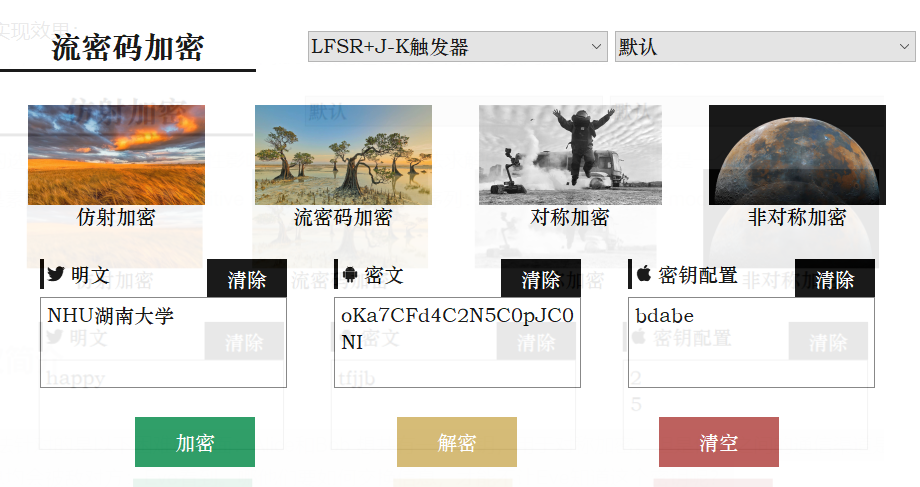

## 仿射加密

原理：

```
仿射密码的加密算法就是一个线性变换，即对任意的明文字符x，对应的密文字符为
```


其中，a,b∈Z26，且要求gcd(a,26)=1,函数e(x)称为仿射加密函数。

加解密过程：

```python
class Radiate:
    # 加密
    def encryption(self, plaintext, KeyConf):
        strr = ''
        KeyConf = KeyConf.decode('utf-8')
        plaintext = plaintext.decode('utf-8')
        a = int(KeyConf.split('\n')[0])
        b = int(KeyConf.split('\n')[1])
        for i in plaintext:
            temp = ord(i) - 97
            t = (temp * a + b) % 26
            te = chr(t + 97)
            strr += te
        return strr
    # 解密
    def decryption(self, ciphertext, KeyConf):
        strr = ''
        KeyConf = KeyConf.decode('utf-8')
        ciphertext = ciphertext.decode('utf-8')
        a = int(KeyConf.split('\n')[0])
        b = int(KeyConf.split('\n')[1])
        aa = inv(a, 26)
        for i in ciphertext:
            temp = ord(i) - 97
            t = ((temp - b + 26) % 26) * aa % 26
            te = chr(t + 97)
            strr += te
        return strr
```

实现效果：

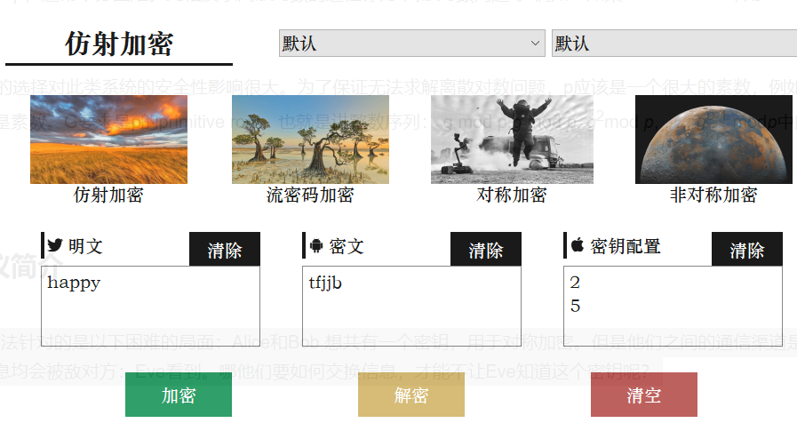

## 对称加密

### DES算法

原理：
DES 使用一个 56 位的密钥以及附加的 8 位奇偶校验位，产生最大 64 位的分组大小。这是一个迭代的分组密码，使用称为 Feistel 的技术，其中将加密的文本块分成两半。使用子密钥对其中一半应用循环功能，然后将输出与另一半进行“异或”运算；接着交换这两半，这一过程会继续下去，但最后一个循环不交换。DES 使用 16 个循环，使用异或，置换，代换，移位操作四种基本运算。


加解密过程：

```python
class des_crypto:
    #密钥的初始化
    def __init__(self, Key, mode):
        self.key = Key
        self.mode = mode
        # self.mode = DES.MODE_CBC #改为可修改
    #加密，这里直接调用库中的DES函数
    def encrypt(self, decryptText):
        if self.mode == DES.MODE_ECB:
            cipher1 = DES.new(self.key, self.mode)
        elif self.mode == DES.MODE_CTR:
            cipher1 = DES.new(self.key, self.mode, nonce= b'0000000')
        else:
            cipher1 = DES.new(self.key, self.mode, self.key)
        # 分组补全
        length = 8
        TextNum = len(decryptText)
        add = (length - (TextNum % length)) % length
        decryptText = decryptText + (b'\0' * add)
        encryptText = cipher1.encrypt(decryptText)
        return encryptText
    #解密，这里也是直接调用库中的DES函数
    def decrypt(self, encryptText):
        if self.mode == DES.MODE_ECB:
            cipher2 = DES.new(self.key, self.mode)
        elif self.mode == DES.MODE_CTR:
            cipher2 = DES.new(self.key, self.mode, nonce=b'0000000')
        else:
            cipher2 = DES.new(self.key, self.mode, self.key)
        decryptText = cipher2.decrypt(encryptText)
        decryptText = decryptText.rstrip(b'\0')
        return decryptText
```

实现效果：

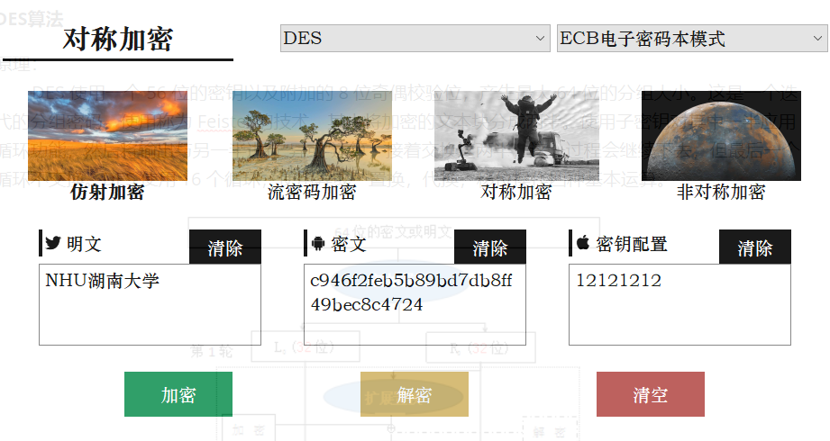

### AES算法

原理：

```
AES加密过程涉及到4种操作，分别是字节替代、行移位、列混淆和轮密钥加。解密过程分别为对应的逆操作。由于每一步操作都是可逆的，按照相反的顺序进行解密即可恢复明文。加解密中每轮的密钥分别由初始密钥扩展得到。算法中16个字节的明文、密文和轮密钥都以一个4x4的矩阵表示。
```


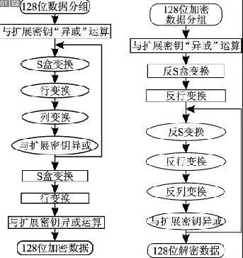

加解密过程：

```python
class aes_crypto:
    #密钥的初始化
    def __init__(self, Key, mode):
        self.key = Key
        self.mode = mode
    #加密，这里直接调用的是库中的AES函数
    def encrypt(self, decryptText):
        iv= str(self.key)[:16].encode()
        if self.mode == AES.MODE_ECB:
            cipher1 = AES.new(self.key, self.mode)
        elif self.mode == AES.MODE_CTR:
            cipher1 = AES.new(self.key, self.mode, nonce=b'0000000')
        else:
            cipher1 = AES.new(self.key, self.mode, iv)
        # 分组补全
        length = 16
        TextNum = len(decryptText)
        add = (length - (TextNum % length)) % length
        decryptText = decryptText + (b'\0' * add)
        encryptText = cipher1.encrypt(decryptText)
        return encryptText
    #解密，这里直接调用的是库中的AES函数
    def decrypt(self, encryptText):
        iv = str(self.key)[:16].encode()
        if self.mode == AES.MODE_ECB:
            cipher2 = AES.new(self.key, self.mode)
        elif self.mode == AES.MODE_CTR:
            cipher2 = AES.new(self.key, self.mode, nonce=b'0000000')
        else:
            cipher2 = AES.new(self.key, self.mode, iv)
        decryptText = cipher2.decrypt(encryptText)
        decryptText = decryptText.rstrip(b'\0')
        return decryptText
```

实现效果：

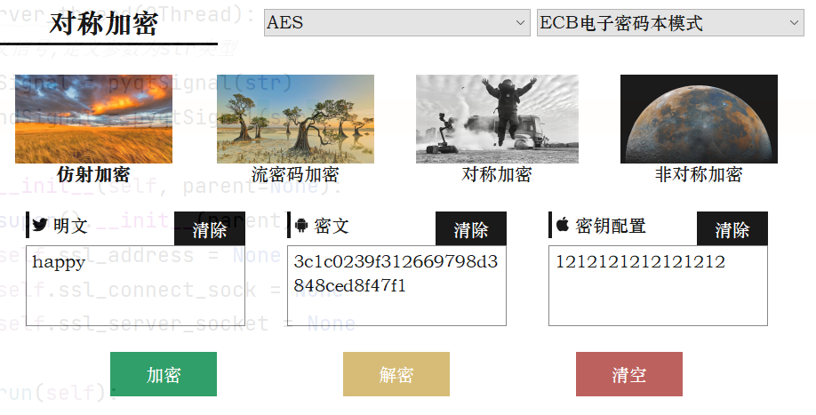

## 非对称加密

原理：

```
假设有消息发送方A和消息接收方B，通过下面的几个步骤，就可以完成消息的加密传递：
（1）消息发送方A在本地构建密钥对，公钥和私钥；（2）消息发送方A将产生的公钥发送给消息接收方B；（3）B向A发送数据时，通过公钥进行加密，A接收到数据后通过私钥进行解密，完成一次通信。
```


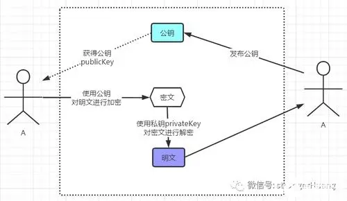

公钥私钥的生成过程：

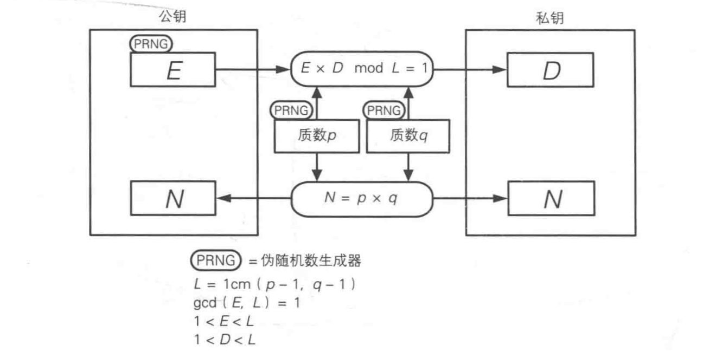

加解密过程：

```python
class RSA:
   #计算公钥和私钥
    def __init__(self):
        self.p = 587
        self.q = 113
        self.n = self.p * self.q
        self.e = 5
        self.d = (Get_Inverse(self.e, (self.p - 1) * (self.q - 1)) + (self.p - 1) * (self.q - 1)) % (
                (self.p - 1) * (self.q - 1))

    def encrypt(self, M):
        return ksm(M, self.e, self.n)

    def decrypt(self, C):
        return ksm(C, self.d, self.n)
    #使用私钥进行加密
    def Encrypt(self, plaintxt):
        s = plaintxt
        s1 = []
        for x in s:
            temp = int(format(ord(x), 'b'), 2)
            if temp >= 2 ** 8:
                s1.append(0)
                s1.append(int(temp / 256))
                s1.append(0)
                s1.append(temp % 256)
            else:
                s1.append(temp)
        if len(s1) % 2 == 1:
            s1.append(1)
        s2 = []
        i = 0
        while True:
            temp = s1[i] * (2 ** 8) + s1[i + 1]
            i = i + 2
            s2.append(self.encrypt(temp))
            if i >= len(s1):
                break
        return s2
    #使用公钥进行解密
    def Decrypt(self, cipher):
        s2 = cipher
        s3 = []
        i = 0
        while True:
            temp = self.decrypt(s2[i])
            i = i + 1
            s3.append(int(temp / 256))
            if temp % 256 != 1:
                s3.append(temp % 256)
            if i >= len(s2):
                break
        s4 = ''
        i = 0
        while True:
            if s3[i] == 0:
                temp = s3[i + 1] * 256 + s3[i + 3]
                s4 += chr(temp)
                i += 3
            else:
                s4 += chr(s3[i])
            i = i + 1
            if i >= len(s3):
                break
        return s4
```

实现效果：
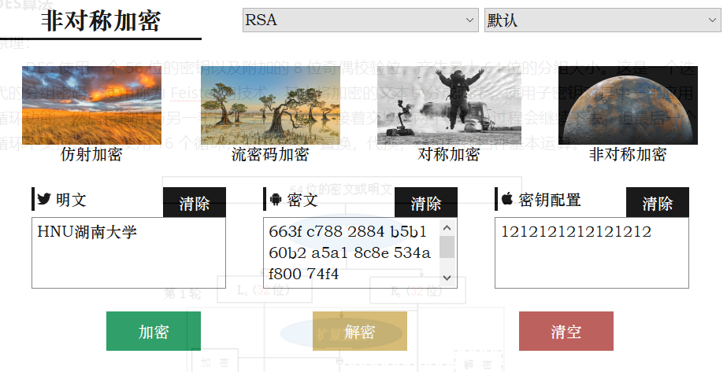

# DH协议

```
DH协议的出现是为了解决以下困难：Alice和Bob 想共有一个密钥用于对称加密，但是他们之间的通信渠道是不安全的，所有经过此渠道的信息均会被敌对方Eve看到。DH协议就很好地解决了这个问题，以下是DH协议的方案：
```


（1）Alice和Bob先对p 和g达成一致，而且公开出来。Eve也就知道它们的值了。

```python
class Gen_Key():
    def __init__(self):
        random_generator = Random.new().read
        rsa = RSA.generate(2048, random_generator)
        self.private_pem = rsa.exportKey()
        with open('master-privatekey.pem', 'wb+') as f:
            f.write(self.private_pem)
        self.private_key = RSA.importKey(open('master-privatekey.pem').read())
        self.public_pem = rsa.publickey().exportKey()
        with open('master-publickey.pem', 'wb+') as f:
            f.write(self.public_pem)
        self.public_key = RSA.importKey(open('master-publickey.pem', 'r').read())

    def get_pri(self):
        return self.private_key

    def get_pub(self):
        return self.public_key

    def get_pub_pem(self):
        return self.public_pem
```

```python
class ex_DH():
    def __init__(self, private_key, public_key):
        self.private_key = private_key
        self.public_key = public_key

    def rsa_sign(self, message):
        # 对消息进行签名
        h = MD5.new(message.encode(encoding='utf-8'))
        rsa = PKCS1_v1_5.new(self.private_key)
        signature = rsa.sign(h)
        return signature

    def rsa_verify(self, message, signature):
        # 对消息进行签名验证
        h = MD5.new(message.encode(encoding='utf-8'))
        verifier = PKCS1_v1_5.new(self.public_key)
        if verifier.verify(h, signature):
            print("OK")
        else:
            print("Invalid Signature")

    def random_key(self):
        return (random.randint(2, self.p - 2))  # 得到私钥

    def fastExpMod(self, b, e, m):
        result = 1
        while e != 0:
            if (e & 1) == 1:
                # ei = 1, then mul
                result = (result * b) % m
            e >>= 1
            # b, b^2, b^4, b^8, ... , b^(2^n)
            b = (b * b) % m
        return result

    # A，B得到各自的计算数
    def get_calculation(self, X):
        return self.fastExpMod(self.proot, X, self.p)

    # A，B得到交换计算数后的密钥
    def get_key(self, X, Y):
        return self.fastExpMod(Y, X, self.p)
```

（2）Alice取一个私密的整数a，不让任何人知道，发给Bob 计算结果：*A*=*ga* mod*p.* Eve 也看到了A的值。

```python
test = Gen_Key()
dh = ex_DH(test.get_pri(), test.get_pub())
# 得到A的私钥
XA = dh.random_key()
print('A随机生成的私钥为：%d' % XA)

 # 得到A的计算数并进行消息签名和认证
    YA = dh.get_calculation(XA)
    print('A的计算数为：%d' % YA)
    signature = dh.rsa_sign(str(YA))
    dh.rsa_verify(str(YA), signature)
```

（3）类似,Bob 取一私密的整数b,发给Alice计算结果*B*=*gb* mod *p.*同样Eve也会看见传递的B是什么。

```python
# 得到B的私钥
XB = dh.random_key()
print('B随机生成的私钥为：%d' % XB)

# 得到B的计算数并进行消息签名和认证
    YB = dh.get_calculation(XB)
    print('B的计算数为：%d' % YB)
    signature = dh.rsa_sign(str(YB))
    dh.rsa_verify(str(YB), signature)
```

（4）Alice 计算出*S*=*B a* mod *p*=(*gb*)*a* mod*p=gab*mod *p.*

```python
# 交换后A的密钥
key_A = dh.get_key(XA, YB)
print('A的生成密钥为：%d' % key_A)
```

（5） Bob 也能计算出*S*=*Ab* mod *p*=(*ga*)*b*mod*p=gab*mod *p.*

```pytho
# 交换后B的密钥
key_B = dh.get_key(XB, YA)
print('B的生成密钥为：%d' % key_B)
```

（6） Alice 和 Bob 现在就拥有了一个共用的密钥S.

```
key_A=key_B
```

（7）虽然Eve看见了*p*,*g*, *A* and *B*, 但是鉴于计算离散对数的困难性，她无法知道*a*和*b* 的具体值。所以Eve就无从知晓密钥S 是什么了。

```
在本次实验中DH协议为AES网络通信提供了一个共同的密钥，具体过程如下：
```


```python
# 生产公私钥，并且发送公钥
def click_PP_key(self):
    test = _dh.Gen_Key()
    self.public_key = test.get_pub()
    self.private_key = test.get_pri()
    self.send_Show_msg(str(test.public_key) + '\n')
    self.send_Show_msg(str(test.private_key) + '\n')
    self.client_send('[#1]', '[#1]' + str(self.public_key))
# DH协议协商共享密钥
def click_Change_key(self):
    test = _dh.ex_DH(self.private_key, self.public_key)
    self.XA = test.random_key()
    YA = test.get_calculation(self.XA)
    self.client_send('[#2]', '[#2]' + str(YA))
```

实现效果如下：
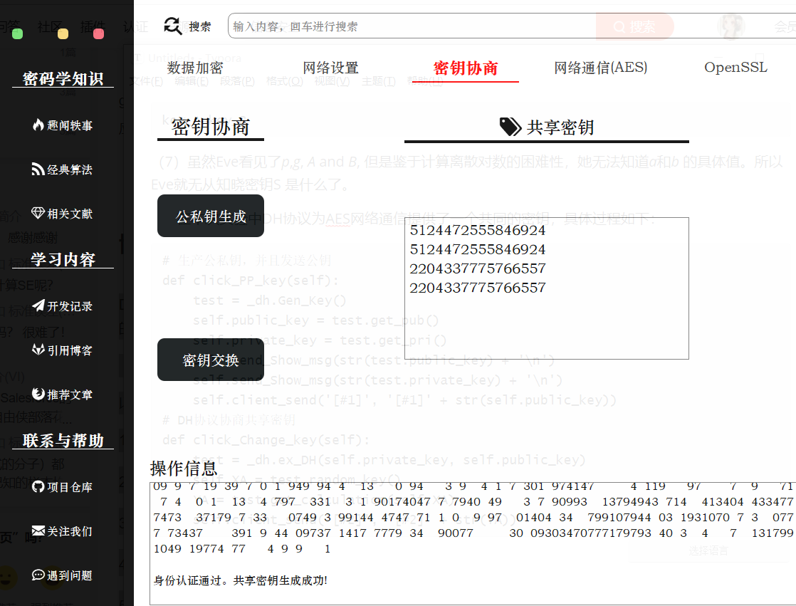

# openssl通信部分

## openssl安装

利用第三方提供的开源工具直接无脑安装，例如：
http://slproweb.com/products/Win32OpenSSL.html

直接按照普通的windows程序next，next的安装就行了。

最后我们在环境变量中，将bin文件夹配置起来，就可以在命令行中调用OpenSSL了。如果暂时没成功的话就重启一下电脑让配置生效。


查看是否安装成功


## ssl通信原理


SSL通信的本质是啥？本质就是客户端拿着认证机关的证书去认证对方网站到底是不是你要访问的。

因为有人会写一个假的网站骗取流量（及流量劫持）。如果一旦在这个假的网站上输入了用户名密码之后就存在着信息滥用的风险。

为了避免这样的情况，所以才有SSL这个工具。

- 客户端以后每次访问一个重要的网站时就要拿着发证机关CA（Cerficate Authority）的证书和对方连接的时候验证一下。咋验证的呢？客户端连接的时候服务端也有证书，这个证书也是CA发给他们的，里面的内容进行了加密，只要拿CA发给客户的那个证书对接一些就知道对面网站的那个证书是不是真的。这就是SSL的基本逻辑。
- 同时通信的过程也是加密了的，这样就不太容易被窃听的人看明白（即中间人攻击）。

所以SSL等于解决了两个问题，1 流量劫持 2 中间人攻击。

**SSL协议通信的握手步骤**如下：

- 第1步，SSL客户机连接至SSL服务器，并要求服务器验证它自身的身份；
- 第2步，服务器通过发送它的数字证书证明其身份。这个交换还可以包括整个证书链，直到某个根证书颁发机构（CA）。通过检查有效日期并确认证书包含可信任CA的数字签名来验证证书的有效性。
- 第3步，服务器发出一个请求，对客户端的证书进行验证，但是由于缺乏公钥体系结构，当今的大多数服务器不进行客户端认证。
- 第4步，协商用于加密的消息加密算法和用于完整性检查的哈希函数，通常由客户端提供它支持的所有算法列表，然后由服务器选择最强大的加密算法。
- 第5步，客户机和服务器通过以下步骤生成会话密钥：

  - 客户机生成一个随机数，并使用服务器的公钥（从服务器证书中获取）对它加密，以送到服务器上。
  - 服务器用更加随机的数据（客户机的密钥可用时则使用客户机密钥，否则以明文方式发送数据）响应。

## ssl通信实现

### 证书生成

```terminal
# 1.先创建 CA 私钥，这个是用来生成ca.crt用的
openssl genrsa -out ca.key 2048

# 2.然后生成自签名CA证书，这个才是我们要用的东西。
openssl req -new -x509 -days 3650 -key ca.key -out ca.crt -subj "/C=CN/ST=hunan/L=changsha/O=HNU/OU=csee/CN=CA_zino"

# 3.生成服务器私钥。注意这个跟刚才那个CA不是一回事了，相当于实际业务中的需要被认证的网站。
openssl genrsa -out server.key 2048

# 4.生成要颁发证书的证书签名请求
openssl req -new -key server.key -out server.csr -subj "/C=CN/ST=hunan/L=changsha/O=HNU/OU=csee/CN=127.0.0.1"

# 5.用刚才第2步创建的 CA 证书给第4步生成的 签名请求 进行签名，表明该证书请求已被CA信任，得到一个被CA签名过的证书。
openssl x509 -req  -days 3650 -in server.csr -CA ca.crt -CAkey ca.key -set_serial 01 -out server.crt

# 之后就是客户端用CA证书来对服务端被CA签名过的证书来进行认证
openssl  verify  -CAfile  ca.crt  server.crt
```


用CA验证服务端证书是否可信


### 服务端实现

ssl类具体函数定义和参数含义可参考[官方文档](https://docs.python.org/zh-cn/3/library/ssl.html#module-ssl)

```python
import socket
import ssl
ip_port = ('127.0.0.1', 9999)
# 创建了一个 SSL上下文,ssl.PROTOCOL_TLS表示选择客户端和服务器均支持的最高协议版本
context = ssl.SSLContext(ssl.PROTOCOL_TLS)
# 加载一个私钥及对应的证书
context.load_cert_chain(certfile="server.crt", keyfile="server.key")

sk = socket.socket()            # 创建套接字
sk.bind(ip_port)                # 绑定服务地址
sk.listen(5)                    # 监听连接请求

print('启动socket服务，等待客户端连接...')

connect_sock, address = sk.accept()     # 等待连接，此处自动阻塞
# 包装一个现有的 Python socket,并返回一个ssl socket,server_side为true表示为服务器行为，默认为false则表示客户端
ssl_connect_sock = context.wrap_socket(connect_sock, server_side=True)
while True:     # 一个死循环，直到客户端发送‘exit’的信号，才关闭连接
    client_data = ssl_connect_sock.recv(1024).decode()      # 接收信息
    if client_data == "exit":       # 判断是否退出连接
        sk.close()  # 关闭连接
        exit("通信结束")
    print("来自%s的客户端向你发来信息：%s" % (address, client_data))
    ssl_connect_sock.sendall('服务器已经收到你的信息'.encode())    # 回馈信息给客户端
```

### 客户端实现

```python
import socket
import ssl
import pprint
# 创建了一个 SSL上下文,ssl.PROTOCOL_TLS表示选择客户端和服务器均支持的最高协议版本
context = ssl.SSLContext(ssl.PROTOCOL_TLS)
# 设置模式为CERT_REQUIRED，在此模式下，需要从套接字连接的另一端获取证书；如果未提供证书或验证失败则将引发 SSLError。
context.verify_mode = ssl.CERT_REQUIRED
# 加载一组用于验证服务器证书的CA证书
context.load_verify_locations("ca.crt")
# 设置端口
ip_port = ('127.0.0.1', 9999)
# 创建套接字
s = socket.socket()
# 包装一个现有的 Python 套接字 sock 并返回一个 SSLContext.sslsocket_class 的实例 (默认为 SSLSocket)。
# 返回的 SSL 套接字会绑定上下文、设置以及证书
ssl_sock = context.wrap_socket(s, server_hostname='127.0.0.1')

# 连接服务器
ssl_sock.connect(ip_port)
# 输出证书信息
pprint.pprint(ssl_sock.getpeercert())
while True:     # 通过一个死循环不断接收用户输入，并发送给服务器
    inp = input("请输入要发送的信息： ").strip()
    if not inp:     # 防止输入空信息，导致异常退出
        continue
    ssl_sock.sendall(inp.encode())

    if inp == "exit":   # 如果输入的是‘exit’，表示断开连接
        print("结束通信！")
        break

    server_reply = ssl_sock.recv(1024).decode()
    print(server_reply)
s.close()    # 关闭连接
```

## 基于UI的实现

因为在UI中我们目标是在一个文件内实现客户端和服务端通信，这就需要采用线程

而如果使用普通的线程创建函数，会遇到在子线程里操作UI界面会出现未知错误的问题

所以后面采用了Qthread这个QT专门提供的线程类

可以实现子线程通过信号量向父线程发送消息，从而达到在父线程里操作UI的目的。

基本框架基于还是上面的代码，但是根据UI的需要，做了一部分必要的改动。

```python
    class server_thread(QThread):
        # 定义信号,定义参数为str类型
        sendSignal = pyqtSignal(str)
        appendSignal = pyqtSignal(str)

        def __init__(self, parent=None):
            super().__init__(parent)
            self.ssl_address = None
            self.ssl_connect_sock = None
            self.ssl_server_socket = None

        def run(self):
            ip_port = ('127.0.0.1', 9999)
            context = ssl.SSLContext(ssl.PROTOCOL_TLS)  # 创建了一个 SSL上下文,ssl.PROTOCOL_TLS表示选择客户端和服务器均支持的最高协议版本
            context.load_cert_chain(certfile="../cert/server.crt", keyfile="../cert/server.key")  # 加载一个私钥及对应的证书

            sk = socket.socket()  # 创建套接字
            sk.bind(ip_port)  # 绑定服务地址
            sk.listen(5)  # 监听连接请求

            msg = '#服务端消息#：启动socket服务，等待客户端连接...'
            self.sendSignal.emit(msg)
            self.ssl_connect_sock, self.ssl_address = sk.accept()  # 等待连接，此处自动阻塞
            # 包装一个现有的 Python socket,并返回一个ssl socket,server_side为true表示为服务器行为，默认为false则表示客户端
            self.ssl_server_socket = context.wrap_socket(self.ssl_connect_sock, server_side=True)
            while True:  # 一个死循环
                client_data = self.ssl_server_socket.recv(1024).decode()  # 接收信息
                if client_data == 'exit':
                    break
                self.appendSignal.emit(client_data)
                msg = "#服务端消息#：收到来自%s的客户端发来的信息:%s" % (self.ssl_address, client_data)
                self.sendSignal.emit(msg)

    class client_thread(QThread):
        # 定义信号,定义参数为str类型
        sendSignal = pyqtSignal(str)
        appendSignal = pyqtSignal(str)

        def __init__(self, parent=None):
            self.ssl_client_socket = None
            super().__init__(parent)

        def run(self):
            context = ssl.SSLContext(ssl.PROTOCOL_TLS)  # 创建了一个 SSL上下文,ssl.PROTOCOL_TLS表示选择客户端和服务器均支持的最高协议版本
            context.verify_mode = ssl.CERT_REQUIRED  # 设置模式为CERT_REQUIRED，在此模式下，需要从套接字连接的另一端获取证书；如果未提供证书或验证失败则将引发 SSLError
            context.load_verify_locations("../cert/ca.crt")  # 加载一组用于验证其他对等方证书的CA证书
            ip_port = ('127.0.0.1', 9999)  # 设置端口
            s = socket.socket()  # 创建套接字
            # 包装一个现有的 Python 套接字 sock 并返回一个 SSLContext.sslsocket_class 的实例 (默认为 SSLSocket)。
            self.ssl_client_socket = context.wrap_socket(s, server_hostname='127.0.0.1')  # 返回的 SSL 套接字会绑定上下文、设置以及证书

            self.ssl_client_socket.connect(ip_port)  # 连接服务器
            msg = '#客户端消息#：客户端成功验证服务端证书，已成功连接，服务端证书信息如下'  # 输出证书信息
            self.sendSignal.emit(msg)
            cert = pprint.pformat(self.ssl_client_socket.getpeercert())
            self.sendSignal.emit(cert)
            msg = '请在文本框输入要发送的消息'
            self.sendSignal.emit(msg)

            while True:  # 一个死循环
                server_data = self.ssl_client_socket.recv(1024).decode()  # 接收信息
                if server_data == 'exit':
                    break
                self.appendSignal.emit(server_data)
                msg = "#客户端消息#：收到来自%s的服务端发来的信息:%s" % (ip_port, server_data)
                self.sendSignal.emit(msg)

    def server_append(self, data):
        self.tab.tab5TextEdit_1.clear()
        self.tab.tab5TextEdit_1.appendPlainText(data)

    def client_append(self, data):
        self.tab.tab5TextEdit_2.clear()
        self.tab.tab5TextEdit_2.appendPlainText(data)

    def ssl_start_server(self):
        self.ssl_server_thread = self.server_thread()
        self.ssl_server_thread.sendSignal.connect(self.send_Show_msg)
        self.ssl_server_thread.appendSignal.connect(self.server_append)
        self.ssl_server_thread.start()

    def ssl_start_client(self):
        self.ssl_client_thread = self.client_thread()
        self.ssl_client_thread.sendSignal.connect(self.send_Show_msg)
        self.ssl_client_thread.appendSignal.connect(self.client_append)
        self.ssl_client_thread.start()

    def ssl_server_send(self):
        text = self.tab.tab5TextEdit_1.toPlainText()
        self.ssl_server_thread.ssl_server_socket.sendall(text.encode())  # 回馈信息给客户端

    def ssl_client_send(self):
        inp = self.tab.tab5TextEdit_2.toPlainText()
        self.ssl_client_thread.ssl_client_socket.sendall(inp.encode())
```

## 运行过程

先点击服务端启动

再点击客户端启动

然后就可以愉快的进行客户端与服务端的ssl通信了

点击停止即可停止通信


# 开发记录

密码学项目

参考链接：

[UI设计参考]([https://mp.weixin.qq.com/s?spm=a2c6h.12873639.0.0.eb782367OsHsnu&__biz=MzI5NDY1MjQzNA==&mid=2247488070&idx=3&sn=0d7fa40a22165e497d1fd27228ff17de&chksm=ec5ecd3bdb29442d8d32a93e0cd35b5f971963a35bceb7e2130aac07493dd04b11acbb370573&scene=0#rd)

[QTabWidget的详细使用](https://blog.csdn.net/jeekmary/article/details/79591431)

[QSS美化](https://blog.csdn.net/qq_40602000/article/details/104652131)

[PyQt5的页面切换](https://blog.csdn.net/wowocpp/article/details/105228300)

[git仓库同步和冲突问题和解决](https://github.com/selfteaching/the-craft-of-selfteaching/issues/67)

成员笔记：

[利用OpenSSL进行通信](https://zino00.github.io/posts/cf547d62/)

[Socket编程实现](https://zino00.github.io/posts/79900945/)

12/16

今日完成登录界面和主界面的部分：


### 12/17

今日把所有界面都完成，并且美化了（大概），看下效果：


### 12/24

工作进入尾声了


