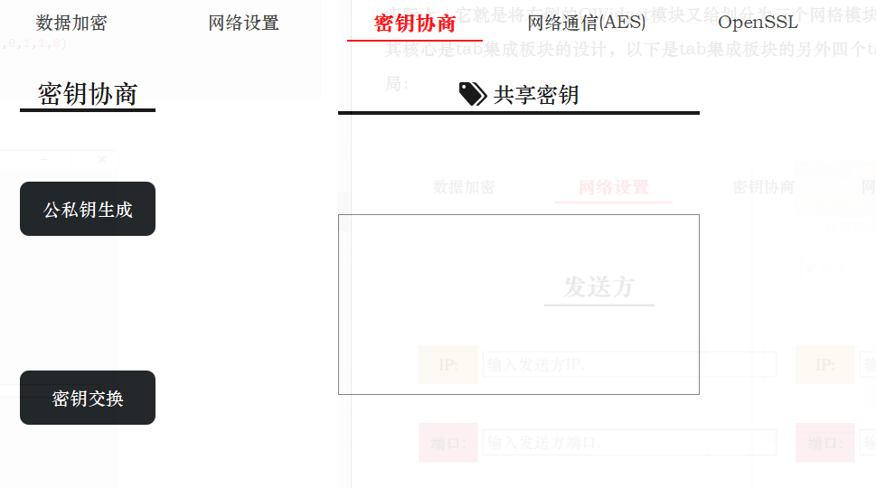
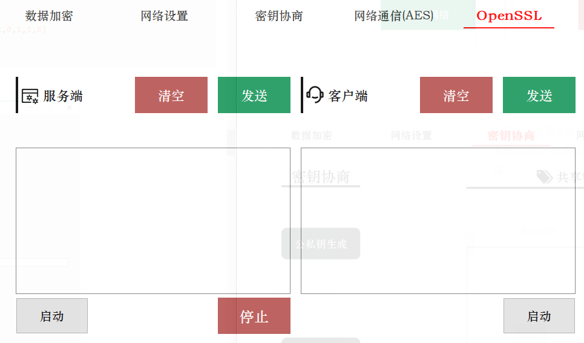
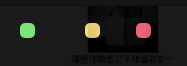

## UI界面设计

### 前言

项目的呈现是以应用程序的方式进行展示，其中的核心之一UI设计是通过PyQt5库进行设计的，该库实际上是C++语言编写的跨平台的GUI库，支持Widows、Mac OS和Linux。由于Qt使用C++语言进行编写，所以使用Qt开发的GUI程序的界面风格与当前操作系统完全相同，而且运行效率很高。

但是在默认情况下，使用PyQt5创建出来的窗口和部件是默认的样式，个人审美下是十分的不美观的，所以需要对构建的图形界面进行一些美化。其实，在PyQt5中，我们可以有较高的自由度来自定义窗口和各种小部件的样式，通过自定义这些样式，以达到美化图形界面的目的。

首先可以看看效果图：


### 对界面进行布局和组件的布局

在图像界面变成中，一个好的布局有助于全局把控界面的形态，而在PyQt5中，有多种布局的方式供我们选择，比较常见的布局有以下计中：

- 表单布局：QFormLayout
- 网格布局：QGridLayout
- 水平排列布局：QHBoxLayout
- 垂直排列布局：QVBoxLayout

这四种布局都有自己对布局内小部件的控制方式和特点，在这个工程中选用网格布局作为图形界面布局的方案。

#### 整体布局

在整体布局中将我们的界面分为左右两个部分，使用两个QWidget()部件作为左侧菜单模块和右侧内容模块的部件，布局分布如下：


其比例是2:10，在代码中体现如下：

```python
        self.main_layout.addWidget(self.left_widget, 0, 0, 12, 2)
        self.main_layout.addWidget(self.right_widget, 0, 2, 12, 10)
```


#### 左侧菜单栏

在左侧菜单栏中依旧使用网格进行布局，在左侧的菜单布局中添加的所有部件均为按钮，即QPushButton()，这些按钮包括菜单按钮、菜单列提示以及窗口的最小化和和关闭功能按钮。其具体的布局如下：

```python
        self.left_layout.addWidget(self.left_mini, 0, 0, 1, 1)
        self.left_layout.addWidget(self.left_close, 0, 2, 1, 1)
        self.left_layout.addWidget(self.left_visit, 0, 1, 1, 1)

        self.left_layout.addWidget(self.left_label_1, 1, 0, 1, 3)
        self.left_layout.addWidget(self.left_button_1, 2, 0, 1, 3)
        self.left_layout.addWidget(self.left_button_2, 3, 0, 1, 3)
        self.left_layout.addWidget(self.left_button_3, 4, 0, 1, 3)

        self.left_layout.addWidget(self.left_label_2, 5, 0, 1, 3)
        self.left_layout.addWidget(self.left_button_4, 6, 0, 1, 3)
        self.left_layout.addWidget(self.left_button_5, 7, 0, 1, 3)
        self.left_layout.addWidget(self.left_button_6, 8, 0, 1, 3)

        self.left_layout.addWidget(self.left_label_3, 9, 0, 1, 3)
        self.left_layout.addWidget(self.left_button_7, 10, 0, 1, 3)
        self.left_layout.addWidget(self.left_button_8, 11, 0, 1, 3)
        self.left_layout.addWidget(self.left_button_9, 12, 0, 1, 3)
```

但是目前还没有进行样式的修改，只是单纯的将按钮给安到对应的网格当中，后面会具体介绍美化的方式以及跳转功能的实现。

#### 右侧菜单栏

在右侧的内容模块中，有三个主要内容板块：

- 搜索板块
- 加解密，D-H协议以及OpenSSL三个集成的tab板块
- 操作信息显示板块

首先介绍一下三个板块的主要功能，搜索板块功能主要是打开浏览器将你所想要的内容利用百度进行搜索；集成tab板块主要是实现四种常见的加解密算法，D-H协议的通信以及OpenSSL的通信；操作信息显示板块则是将所有进行的操作进行显示，比如连接了网络，断开了网络等等……

其具体的网格分布图如下：


实际上，它就是将右侧的QWidget模块又给划分为三个网格模块。对于第一个和第三个板块容易实现，其核心是tab集成板块的设计，以下是tab集成板块的另外四个tab窗口的内容展示，它们也都是网络布局：







这个完整内容的实现可以在tapUI.py程序中看到，它利用的是QTabWidget，构建的TabDemo类就是继承这个类实现的，TabDemo的初始化具体如下：

```python
class TabDemo(QTabWidget):
    def __init__(self, parent=None):
        super(TabDemo, self).__init__(parent)

        self.tab1 = QWidget()
        self.tab2 = QWidget()
        self.tab3 = QWidget()
        self.tab4 = QWidget()
        self.tab5 = QWidget()

        self.addTab(self.tab2, "Tab 2")
        self.addTab(self.tab1, "Tab 1")
        self.addTab(self.tab3, "Tab 3")
        self.addTab(self.tab4, "Tab 4")
        self.addTab(self.tab5, "Tab 5")

        self.tab1UI()
        self.tab2UI()
        self.tab3UI()
        self.tab4UI()
        self.tab5UI()

        self.decorate()
```

### 用QSS和部件属性美化窗口部件

部件美化所使用的函数为setStyleSheet()函数，UI的部件美化和tab集成模块的美化都可以在当前类的decorate()函数中实现，由于代码体量较大就不展开一一介绍具体美化的细节，可以参考两篇文章：

- [如何在Python编写精美的图形界面](https://mp.weixin.qq.com/s?spm=a2c6h.12873639.0.0.eb782367OsHsnu&__biz=MzI5NDY1MjQzNA==&mid=2247488070&idx=3&sn=0d7fa40a22165e497d1fd27228ff17de&chksm=ec5ecd3bdb29442d8d32a93e0cd35b5f971963a35bceb7e2130aac07493dd04b11acbb370573&scene=0#rd)
- [Qt编写网易云界面](https://blog.csdn.net/weixin_42126427/article/details/119722142)

举个小例子：

```python
        self.left_close.setStyleSheet('''QPushButton{
        background:#F76677;
        border-radius:5px;}
        QPushButton:hover{background:red;}''')
        self.left_visit.setStyleSheet('''QPushButton{
        background:#F7D674;
        border-radius:5px;}
        QPushButton:hover{background:red;}''')
        self.left_mini.setStyleSheet('''QPushButton{
        background:#6DDF6D;
        border-radius:5px;}
        QPushButton:hover{background:red;}''')
```

这是UI.py文件中decorate函数中对于左上角三个功能按钮的修饰，最终达成的效果就是如下样式：



### 窗口实现无边框和圆角

通过以上的QSS对样式进行调整，所有关于UI的工作基本上完成了。现在需要使用PyQt5中各个部件的其他内置属性来完成这个图形界面的最终美化工作。

#### 设置窗口背景透明

透明的窗口背景会让图形界面右现代感和时尚感，通过以下两个步骤可以进行实现：

```python
self.setWindowOpacity(0.9)
self.setAttribute(QtCore.Qt.WA_TranslucentBackground, True)
```

#### 去除窗口边框

窗口背景设置为透明后的体验很不一样，但是那个默认的边框很不协调，那么去除丑丑的默认边框是必须要做的工作，通过窗口的setWindowFlag()属性我们可以设置窗口的状态从而把边框给隐藏了：

```python
self.setWindowFlag(QtCore.Qt.FramelessWindowHint) # 隐藏边框
```

为了避免隐藏窗口边框后，左侧部件没有背景颜色和边框显示，我们再对左侧部件添加QSS属性：

```python
QWidget#left_widget{    
    background:gray;    
    border-top:1px solid white;    
    border-bottom:1px solid white;    
    border-left:1px solid white;    
    border-top-left-radius:10px;    
    border-bottom-left-radius:10px;
}
```

#### 贴合左右QtWidget模块

可以发现图形界面中左侧部件和右侧部件中有一条缝隙，我们通过设置布局内部件的间隙来把那条缝隙去除掉：

```python
self.main_layout.setSpacing(0)
```

这样出现的图形界面中就没有那条碍眼的缝隙了：

### 按钮点击事件

在UI.py文件中，使用connect函数将点击事件和具体功能进行绑定，然后通过继承，在子类中进行函数功能的重写：

```python
def connect(self):
    # 连接网络按钮
    self.tab.tap1_bottom_buttom_1.clicked.connect(self.click_On_net)
    # 断开网络按钮
    self.tab.tap1_bottom_buttom_2.clicked.connect(self.click_Off_net)
    # 公私钥生成
    self.tab.tap3_left_button_2.clicked.connect(self.click_PP_key)
    # 密钥交换
    self.tab.tap3_left_button_3.clicked.connect(self.click_Change_key)
    # 数字签名
    self.tab.tap4_bottom_buttom_1.clicked.connect(self.click_RSA_sign)
    # 发送消息
......
```

可以看到这些点击事件都是需要进行重写的：

```python
def ssl_end_threading(self):
    raise NotImplementedError

def ssl_start_server(self):
    raise NotImplementedError

def ssl_start_client(self):
    raise NotImplementedError

def remove_serverText(self):
    raise NotImplementedError

def remove_ClientText(self):
    raise NotImplementedError

......
```

